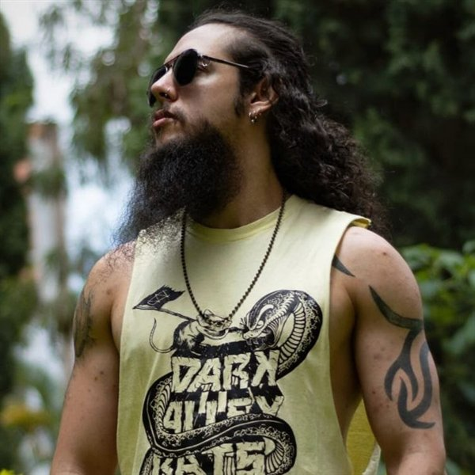

# Renne Castellanos — Portfolio

Personal portfolio of Renne Castellanos, Senior QA Automation Engineer and Full-Stack Developer.

Live site: https://xan217.github.io/portfolio/

Hand-written HTML, CSS and JavaScript with no build step, hosted on GitHub Pages.

## Structure

- `index.html` — the page
- `assets/css/styles.css` — styles
- `assets/js/main.js` — scroll effects, expandable lists, skills timeline
- `assets/cv/` — downloadable CV (PDF)
- `assets/img/` — favicon and, later, `photo.jpg`

## Adding the photo

Save the photo as `assets/img/photo.jpg` and, in `index.html`, replace the
`<span class="avatar-initials">` inside `.avatar` with:

```html

```
